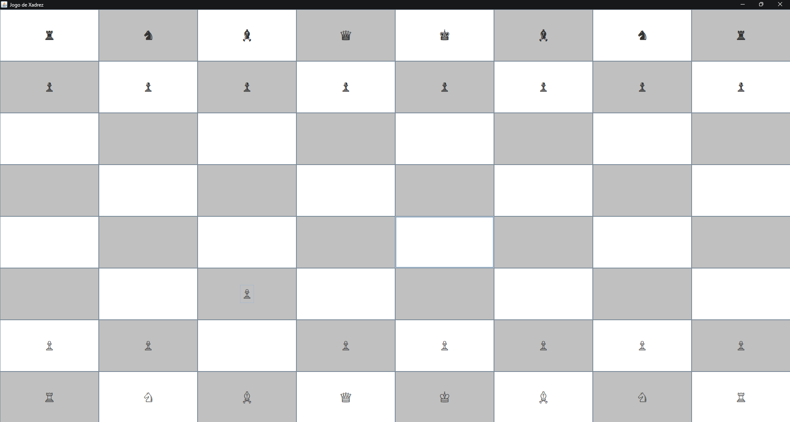

# ♟️ Jogo de Xadrez em Java (MVC + Swing)

Este projeto implementa um jogo de xadrez simplificado utilizando Java, estruturado com arquitetura MVC (Model-View-Controller) e interface gráfica feita com Java Swing.

---

## 🎯 Funcionalidades principais

- ✅ Tabuleiro 8x8 com peças Unicode (♔, ♞, ♙, etc).
- ✅ Interface gráfica interativa com seleção de origem e destino via clique.
- ✅ Alternância de turnos entre jogador branco e preto.
- ✅ Regras básicas de movimentação (sem roque, xeque ou xeque-mate).
- ✅ Salvamento automático do estado do jogo após cada jogada.
- ✅ Sistema de ranking com pontuação por vitória.

---

## 🧱 Estrutura do Projeto

```
📁 src/
 ├── model/        # Representação do tabuleiro e peças
 ├── view/         # Interface gráfica (Swing)
 └── controller/   # Lógica e controle dos eventos da interface
```

---

## 💾 Persistência

- O jogo salva automaticamente o estado atual em arquivo após cada jogada.
- Rankings são mantidos para exibição futura e histórico de partidas.

---

## 🚀 Tecnologias Utilizadas

- Java (JDK 8+)
- Java Swing (GUI)
- Arquitetura MVC
- Serialização de objetos

---

## 📷 Captura de Tela

> 

---

## 🧑‍💻 Autor

Desenvolvido por [Otavio Augusto](https://github.com/OtavioAugustoo)

---

## 📄 Licença

Este projeto é open-source e está sob a licença MIT.
